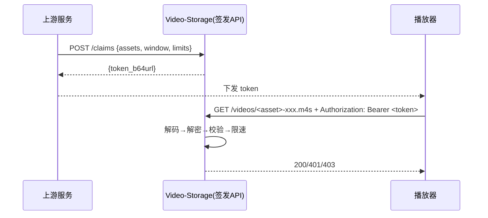

# 视频分发凭证(Claim)方案

## 1. 总览

* **边界**: 上游完成用户鉴权与资源授权; 本服务只负责**签发二进制凭证**与**校验+约束**.
* **携带**: 前端请求时在 `Authorization: Bearer <token>`.
* **版本**: 支持v1(单资产)和v2(多资产)两种凭证格式.



---

## 2. 凭证格式(二进制, 几乎全加密)

**字节序**: LE(小端). 整体再做 **Base64URL(无填充)** 用于传输.

**Token 二进制布局**: **Header(明文)** || **Ciphertext(密文)** || **Tag(16B)** → **Base64URL(无填充)**

> 说明: Tag 是 AEAD 必需的完整性校验结果, 随密文一起组成 token. 无需单独暴露或感知.

### 2.1 明文头(用于解密所需最小信息)

| 字段   |      类型 | 长度 | 说明                                |
| ----- | --------: | --: | ---------------------------------- |
| magic |  `[u8;4]` |   4 | 常量 `b"VSC1"`(v1) / `b"VSC2"`(v2) |
| ver   |      `u8` |   1 | 版本=1或2                           |
| kid   |      `u8` |   1 | 密钥ID                              |
| alg   |      `u8` |   1 | 1=AES-256-GCM; 2=ChaCha20-Poly1305 |
| rsv   |      `u8` |   1 | 预留                                |
| nonce | `[u8;12]` |  12 | AEAD随机nonce                       |

> **AAD**: 整个明文头作为 AEAD 的 AAD.

### 2.2 密文载荷

根据版本号(ver)使用不同的载荷格式:

#### 2.2.1 载荷v1格式(单资产访问)

```rust
struct PayloadV1 {
  exp_unix: u32,
  nbf_unix: u32,
  id_len: u8,
  asset_id: Vec<u8>,
  window_len_sec: u16,
  max_kbps: u16,
  max_concurrency: u8,
  allowed_widths: Vec<u16>,
}
```

| 字段名              |    类型     | 长度   | 说明                    |
| ------------------ | ---------: | -----: | ---------------------- |
| `exp_unix`         | `u32`      |      4 | 过期时间(Unix秒)         |
| `nbf_unix`         | `u32`      |      4 | 生效时间(Unix秒)         |
| `id_len`           | `u8`       |      1 | 资源ID的二进制长度        |
| `asset_id`         | `Vec<u8>`  |    可变 | 单个资源ID               |
| `window_len_sec`   | `u16`      |      2 | 可访问时长(秒, u16 足够)  |
| `max_kbps`         | `u16`      |      2 | 聚合带宽上限, 0=不限      |
| `max_concurrency`  | `u8`       |      1 | 并发上限, 0=不限, 暂不处理 |
| `allowed_widths`   | `Vec<u16>` |    可变 | 授权的清晰度, 为空不限制   |

#### 2.2.2 载荷v2格式(多资产访问)

```rust
struct PayloadV2 {
  exp_unix: u32,
  nbf_unix: u32,
  assets_filter: BinaryFuse16,
  window_len_sec: u16,
  max_kbps: u16,
  max_concurrency: u16,
  allowed_widths: Vec<u16>,
}
```

| 字段名              |       类型       | 长度   | 说明                        |
| ------------------ | --------------: | -----: | -------------------------- |
| `exp_unix`         | `u32`           |      4 | 过期时间(Unix秒)             |
| `nbf_unix`         | `u32`           |      4 | 生效时间(Unix秒)             |
| `assets_filter`    | `BinaryFuse16`  |    可变 | 多资产过滤器(高效查找)        |
| `window_len_sec`   | `u16`           |      2 | 可访问时长(秒)               |
| `max_kbps`         | `u16`           |      2 | 聚合带宽上限, 0=不限          |
| `max_concurrency`  | `u16`           |      2 | 并发上限, 0=不限             |
| `allowed_widths`   | `Vec<u16>`      |    可变 | 授权的清晰度, 为空不限制       |

> **v2优势**: 使用BinaryFuse16过滤器实现高效的多资产匹配, 内存占用和查询时间都优于朴素方法.

### 2.3 AEAD 鉴别标签

| 字段 |      类型 | 长度 | 说明         |
| --- | --------: | --: | ------------ |
| tag | `[u8;16]` |  16 | AEAD 验证标签 |

---

## 3. 内部签发 API

**POST** `/claims`

> 仅内网访问

### 3.1 请求格式

**Request(JSON) - v1格式(单资产)**

```json
{
  "asset_id": "123456",
  "nbf_unix": 1750000000,
  "exp_unix": 1750000600,
  "window_len_sec": 180,
  "max_concurrency": 0,
  "max_kbps": 4000,
  "allowed_widths": [540, 720]
}
```

**Request(JSON) - v2格式(多资产)**

```json
{
  "asset_id": ["video1", "video2", "video3"],
  "nbf_unix": 1750000000,
  "exp_unix": 1750000600,
  "window_len_sec": 180,
  "max_concurrency": 0,
  "max_kbps": 4000,
  "allowed_widths": [540, 720]
}
```

### 3.2 参数说明

| 参数名           | 类型              | 必填 | 说明                          |
| --------------- | ---------------- | ---- | ---------------------------- |
| `asset_id`      | `string\|array`  | 是   | 资源ID, 字符串=v1, 数组=v2     |
| `exp_unix`      | `u32`            | 是   | 过期时间(Unix时间戳)           |
| `nbf_unix`      | `u32`            | 否   | 生效时间(Unix时间戳), 默认当前时间 |
| `window_len_sec`| `u16`            | 否   | 时间窗口长度(秒), 默认0=不限    |
| `max_kbps`      | `u16`            | 否   | 最大带宽(kbps), 默认0=不限      |
| `max_concurrency`| `u16`           | 否   | 最大并发数, 默认0=不限          |
| `allowed_widths`| `Vec<u16>`       | 否   | 允许的视频宽度, 默认空=不限      |

### 3.3 响应格式

**Response 200**

> 直接可给前端使用, 无需再包装.

```json
{ "token": "<token_b64url>" }
```

**错误**: `400/403/500`

---

## 4. 校验流程(边缘/源站)

1. 取 `Authorization` → Base64URL 解码.
2. 解析明文头(`magic, ver, kid, alg, nonce`).
3. 查 key\[kid], 以明文头为 AAD 执行 AEAD 解密.
4. 根据version解析对应格式的载荷.
5. 校验时间: `nbf <= now < exp`.
6. 资源匹配:
   - **v1**: 直接比较 `asset_id` 与路径
   - **v2**: 使用过滤器 `assets_filter.contains(asset_id)`
7. 时间窗口: 分片 `[0, seg-end]` 与 `[0, window_len / sec-per-seg]`.
8. 约束: 并发/QPS/带宽.
9. 放行或返回 `401/403/429`.

---

## 5. 版本选择策略

系统会根据 `asset_id` 参数类型自动选择版本:

- **字符串格式** → 生成 **v1 凭证** (单资产)
- **数组格式** → 生成 **v2 凭证** (多资产)

### 5.1 使用场景建议

- **v1凭证**: 适用于单个视频/资源的访问控制
- **v2凭证**: 适用于批量视频访问、播放列表、多集电视剧等场景

### 5.2 性能对比

| 方面     | v1            | v2                    |
| ------- | ------------- | -------------------- |
| 资产数量 | 单个           | 多个(建议<10000)      |
| 内存占用 | 极小           | 小(取决于资产数量)     |
| 查询速度 | O(1)直接比较   | O(1)过滤器查找        |
| 凭证大小 | 小             | 中等(取决于过滤器大小) |

---

## 6. 错误码(对前端)

* `401`: `invalid_token` / `token_expired` / `aead_fail` / `token_not_yet_valid`
* `403`: `asset_mismatch` / `time_window_deny`
* `429`: `concurrency_exceeded` / `qps_exceeded` / `kbps_exceeded`

---

## 7. 密钥与版本

* `kid (u8)`: 可轮换; 旧Key保留至最长过期×2.
* `ver (u8)`: 结构升级用; 校验兼容旧版.
* `alg`: 固定一种或保留枚举.

---

## 8. 高级特性

### 8.1 过滤器优化

v2凭证使用 [xorf](https://github.com/ayazhafiz/xorf) 库的 `BinaryFuse16` 过滤器:

- **空间效率**: 每个元素约占用16-20bits存储
- **查询效率**: O(1)时间复杂度, 无哈希冲突
- **假阳性率**: 非常低(< 0.01%)
- **无假阴性**: 包含的资产一定会被正确识别

### 8.2 向后兼容性

- 新版本服务器同时支持v1和v2凭证校验
- 客户端可以根据需要选择合适的凭证版本
- 现有v1凭证继续正常工作, 无需迁移