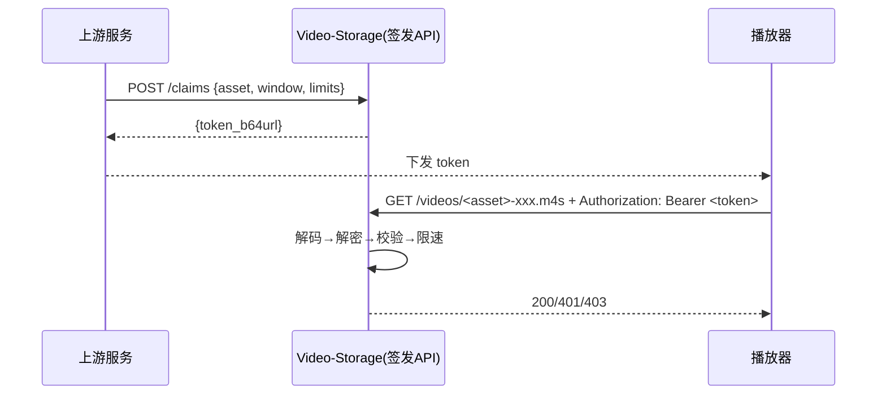

# 视频分发凭证(Claim)方案(v1)

## 1. 总览

* **边界**: 上游完成用户鉴权与资源授权; 本服务只负责**签发二进制凭证**与**校验+约束**.
* **携带**: 前端请求时在 `Authorization: Bearer <token>`.



---

## 2. 凭证格式(二进制, 几乎全加密)

**字节序**: LE(小端). 整体再做 **Base64URL(无填充)** 用于传输.

**Token 二进制布局**: **Header(明文)** || **Ciphertext(密文)** || **Tag(16B)** → **Base64URL(无填充)**

> 说明: Tag 是 AEAD 必需的完整性校验结果, 随密文一起组成 token. 无需单独暴露或感知.

### 2.1 明文头(用于解密所需最小信息)

| 字段   |      类型 | 长度 | 说明                                |
| ----- | --------: | --: | ---------------------------------- |
| magic |  `[u8;4]` |   4 | 常量 `b"VSC1"`                      |
| ver   |      `u8` |   1 | 版本=1                              |
| kid   |      `u8` |   1 | 密钥ID                              |
| alg   |      `u8` |   1 | 1=AES-256-GCM; 2=ChaCha20-Poly1305 |
| rsv   |      `u8` |   1 | 预留                                |
| nonce | `[u8;12]` |  12 | AEAD随机nonce                       |

> **AAD**: 整个明文头作为 AEAD 的 AAD.

### 2.2 密文载荷(完全加密)

```rust
struct PayloadV1 {
  exp_unix: u32,
  nbf_unix: u32,
  id_len: u8,
  asset_id: Vec<u8>,
  window_len_sec: u16,
  max_kbps: u16,
  max_concurrency: u8,
  allowed_widths: Vec<u16>,
}
```

| 字段名              |    类型     | 长度   | 说明                    |
| ------------------ | ---------: | -----: | ---------------------- |
| `exp_unix`         | `u32`      |      4 | 过期时间(Unix秒)         |
| `nbf_unix`         | `u32`      |      4 | 生效时间(Unix秒)         |
| `id_len`           | `u8`       |      1 | 资源ID的二进制长度        |
| `asset_id`         | `Vec<u8>`  |    可变 | 资源ID                  |
| `window_len_sec`   | `u16`      |      2 | 可访问时长(秒, u16 足够)  |
| `max_kbps`         | `u16`      |      2 | 聚合带宽上限, 0=不限      |
| `max_concurrency`  | `u8`       |      1 | 并发上限, 0=不限, 暂不处理 |
| `allowed_widths`   | `Vec<u16>` |    可变 | 授权的清晰度, 为空不限制   |

### 2.3 AEAD 鉴别标签

| 字段 |      类型 | 长度 | 说明         |
| --- | --------: | --: | ------------ |
| tag | `[u8;16]` |  16 | AEAD 验证标签 |

---

## 3. 内部签发 API

**POST** `/claims`

> 仅内网访问

**Request(JSON)**

```json
{
  "asset_id": "123456",
  "nbf_unix": 1750000000,
  "exp_unix": 1750000600,
  "window_len_sec": 180,
  "max_concurrency": 0,
  "max_kbps": 4000,
  "allowed_widths": [540, 720]
}
```

**Response 200**

> 直接可给前端使用, 无需再包装.

```json
{ "token": "<token_b64url>" }
```

**错误**: `400/403/500`

---

## 4. 校验流程(边缘/源站)

1. 取 `Authorization` → Base64URL 解码.
2. 解析明文头(`magic, ver, kid, alg, nonce`).
3. 查 key\[kid], 以明文头为 AAD 执行 AEAD 解密.
4. 校验时间: `nbf <= now < exp`.
5. 资源匹配: `asset_id` 与路径(或路径哈希).
6. 时间窗口: 分片 `[0, seg-end]` 与 `[0, window_len / sec-per-seg]`.
7. 约束: 并发/QPS/带宽.
8. 放行或返回 `401/403/429`.

---

## 7. 错误码(对前端)

* `401`: `invalid_token` / `token_expired` / `aead_fail`
* `403`: `asset_mismatch` / `time_window_deny`
* `429`: `concurrency_exceeded` / `qps_exceeded` / `kbps_exceeded`

---

## 8. 密钥与版本

* `kid (u8)`: 可轮换; 旧Key保留至最长过期×2.
* `ver (u8)`: 结构升级用; 校验兼容旧版.
* `alg`: 固定一种或保留枚举.
